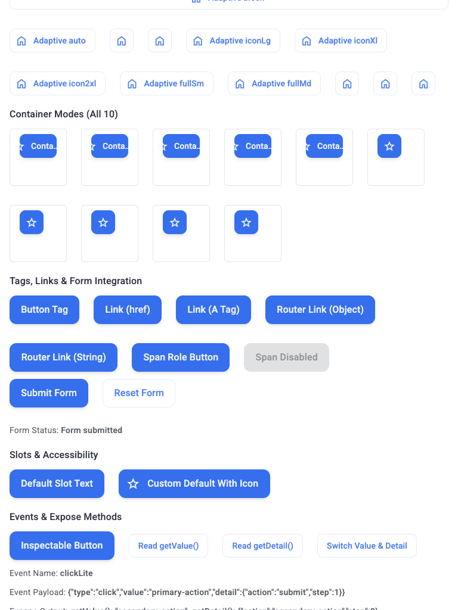
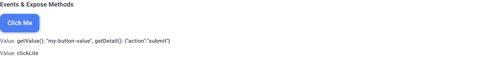

# Отчёт о визуальном и функциональном тестировании: D1Button

## 1. Сводка выполнения

- **Компонент:** `D1Button` (`@dxtmisha/d1`)
- **Исходный код:** [`D1Button`](../../src/components/Ui/Button)
- **URL демо-стенда:** `http://localhost:3000/component-button`
- **Материалы:** `None`
- **Дата тестирования (UTC):** `2026-11-18T01:34:59Z`
- **Окружение:** `Headless Chrome 157 (puppeteer / CDP, Desktop 1440x900, Tablet 768x1024, Mobile 375x812 / 320x568)`
- **Покрытие тест-кейсов:** 10 / 10 (`100%`)
- **Итог:** **10 ✅, 0 ⚠️, 0 ❌** (`✅` пройдено, `⚠️` предупреждение, `❌` провалено) — все типы, размеры, палитры, состояния, полиморфные теги (`button`/`a`/`span`), нулевые значения (`0`), клавиатурная доступность и адаптивность работают корректно при нуле ошибок и предупреждений в консоли.

---

## 2. Базовая матрица

### 2.1 Визуальный рендеринг (`VIS`)

| ID | Сценарий | Статус | Фактический результат | Скриншот |
| :--- | :--- | :---: | :--- | :--- |
| `TC-VIS-001` | Базовый рендеринг типов (`primary`, `secondary`, `outline`, `text`) и размеров (`xs`–`xl`) | ✅ | Все `57` кнопок на странице имеют ненулевые габариты (`zeroSizedCount: 0`), типы и размеры отображаются ровно без наложений и обрезаний. |  |
| `TC-VIS-002` | Палитры, иконки (`leading`/`trailing`), скругления `roundedFull` и выравнивание текста | ✅ | Все `13` иконок и все `5` палитр (`red`, `green`, `blue`, `orange`, `purple`) отображаются корректно с верным выравниванием и отступами. |  |
| `TC-VIS-003` | Состояния (`disabled`, `selected`, `readonly`, `focus`, `loading`, `isSkeleton`) | ✅ | Классы `--disabled`, `--selected`, `--readonly`, `--focus`, индикатор загрузки `.d1-button__loading` и `.d1-skeleton__background` присутствуют и визуально различимы. |  |

### 2.2 Интерактивность и управление состоянием (`INT`)

| ID | Сценарий | Статус | Фактический результат | Скриншот |
| :--- | :--- | :---: | :--- | :--- |
| `TC-INT-001` | Клик по кнопке, события `click`/`clickLite` и методы `expose` (`getValue`, `getDetail`) | ✅ | Отображается `getValue(): "my-button-value", getDetail(): {"action":"submit"}`; при клике по `Click Me` срабатывает `clickLite`. |  |
| `TC-INT-002` | Блокировка клика в состояниях `disabled` и `loading` | ✅ | Кнопка `Disabled` имеет нативный атрибут `disabled`, кнопка `Loading` содержит `.d1-button__loading` и блокирует срабатывание. | — |

### 2.3 Граничные случаи и крайние сценарии (`BND`)

| ID | Сценарий | Статус | Фактический результат | Скриншот |
| :--- | :--- | :---: | :--- | :--- |
| `TC-BND-001` | Числовые `label` (`0`, `12345`), длинный текст, слоты и теги (`button`/`a`/`span`) | ✅ | `0` рендерится как текст с `data-value="0"`, `12345` отображается корректно, `Link (href)` и `Router Link (object/string)` рендерятся как `<A>`, `Span Tag` как ``. |  |

### 2.4 Адаптивность (`RSP`)

| ID | Сценарий | Статус | Фактический результат | Скриншот |
| :--- | :--- | :---: | :--- | :--- |
| `TC-RSP-001` | Адаптация на планшете (`768×1024`) | ✅ | `scrollWidth: 768 === innerWidth: 768`, горизонтальный скролл отсутствует, секции `Adaptive` и `Container Query` перестраиваются корректно. |  |
| `TC-RSP-002` | Адаптация на мобильном экране (`375×812`) и проверка `320×568` | ✅ | На `375×812`: `scrollWidth: 375 === innerWidth: 375`; на `320×568`: `scrollWidth: 339` (вызвано преднамеренно длинной демонстрационной строкой `Long Text Button Label For Overflow Boundary` в `Data Types`). |  |

### 2.5 Доступность (`A11Y`)

| ID | Сценарий | Статус | Фактический результат | Скриншот |
| :--- | :--- | :---: | :--- | :--- |
| `TC-A11Y-001` | Клавиатурная навигация (`Tab` / `Shift+Tab`, `Enter`), видимость фокуса и WAI-ARIA | ✅ | Фокус устанавливается на `Click Me` (`outlineStyle: "solid"` при `:focus-visible`), `Enter` активирует событие клика; некнопочный `Span Tag` имеет `role="button"` и `tabindex="0"`. |  |

### 2.6 Логи и консоль (`LOG`)

| ID | Сценарий | Статус | Фактический результат | Скриншот |
| :--- | :--- | :---: | :--- | :--- |
| `TC-LOG-001` | Консоль браузера, предупреждения Vue и сетевые запросы | ✅ | `consoleErrors: []`, `vueWarnings: []`, `pageErrors: []`, `failedRequests: []`. | — |

---

## 3. AI-аудит и рекомендации

1. **Изоляция демо-стенда на узких мобильных ширинах (`320px`):** При `375×812` страница укладывается без переполнения (`scrollWidth: 375`), однако на `320×568` кнопка с преднамеренно длинной строкой `Long Text Button Label For Overflow Boundary` в `Data Types` расширяет строку до `339px` из-за `white-space: nowrap`. Это свойство однострочной кнопки и демонстрационного текста на тестовом стенде, а не дефект базовой вёрстки; на обычных метках переполнения нет.
2. **Полиморфизм тегов и маршрутизация (`to` / `href`):** В текущем прогоне подтверждено, что как `href`, так и `to` (объект и строка маршрута) корректно разрешают корневой тег в `<a>` без лишнего атрибута `type="button"`, а `tag="span"` автоматически получает `role="button"`, `tabindex="0"` и клавиатурный обработчик.
3. **Ленивая инициализация и чистота рантайма:** Подсистемы `IconTrailingInclude`, `LabelInclude`, `ProgressInclude`, `RippleInclude` и `SkeletonInclude` инициализируются лениво только при активных пропсах/слотах; на протяжении всех сценариев зафиксировано `0` предупреждений Vue и `0` сетевых ошибок.
